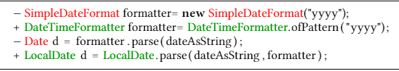

TypeChangeMiner
=================
 TypeFactMiner is a tool written in Java, can detect the type changes applied in the history of a Java Project.
 
 An example of a type change is: 
 
 
 
 TypeChangeMiner is developed as the part of the empirical study : [Understanding Type Changes in Java](https://users.encs.concordia.ca/~nikolaos/publications/FSE_2020.pdf).
 
 TypeChangeMiner is a built upon the widely used RefactoringMiner project, that detects 43 types of refactorings applied in the history of a project.
 TypeChangeMiner provides fine-grained detailed insight into transformations 
 `Change Variable Type`, `Change Field Type`, `Change Parameter Type` and `Change Method Return Type`.
 This tool analyses the project and resolves type bindings of variable and method declarations, without building (or compiling) the project.
 Using such detailed information it provides fine-grained details like :
 * fully-qualified names of the types involved in the type change
 * the adaptations performed for applying the type change (e.g. updating callsites or initializers)
 * the third-party libraries used by the projects
   * the libraries introduced, updated or removed in the commit history of a maven project
 
 We have also collected such fine-grained information by mining 450,000 commits in 130 highly rated java projects.
 Our data set is available [here]().
 [Here]() is the description of our dataset along with some instruction to explore it.
 
 # How to use TypeChangeMiner
 ## Prerequisites of TypeChangeMiner:
 * Java 11 +
 * python 3 
 * maven
 
 ## Instructions:
 
 ### Setup
 * Clone this repository along with its submodules
  `git clone --recurse-submodules https://github.com/ameyaKetkar/TypeChangeMiner.git`
 * Import the repository in your favorite IDE as a maven project. 

 To set up TypeChangeMiner choose a folder `/path/to/the/experiment/folder`, where TypeChangeMiner will store
  all the data collected during mining. Then:
 * Run `cd ../TypeChangeMiner` and run `pip install -r requirements.txt`
 * Update the property `PathToSetup` to `/path/to/the/experiment/folder` in this [file](paths.properties)
 * Run `python scripts/Setup.py /path/to/the/experiment/folder`. 
 
 
 ### Running TypeChangeMiner
 Currently, TypeChangeMiner uses apache-tinkerpop server for caching the type bindings so that one can efficiently 
 resolve type bindings across the history of the project. 
 
 To run the server:
 * cd `/path/to/the/experiment/folder`
 * cd `apache-tinkerpop-gremlin-server-3.4.4/bin`
 * For Linux/Mac run : `./gremlin-server.sh console`
 * For Windows run : `gremlin-server.bat`
 
 To run TypeChangeMiner
 * Provide list of input projects to TypeChangeMiner:
 ** Add the name and github url of the projects (that you want to analyze) to the file * Update the property `PathToSetup` to `/path/to/the/experiment/folder/Corpus/InputProjects.csv`.
 * Run the main method in the [TypeFactMiner](src/main/java/org/osu/TypeFactMiner.java)

 To explore the results mined by TypeChangeMiner run `python /scripts/ProtoToJson.py`
 ** This script extracts all the interesting information from the mined results in a JSON format.

 
 ## Using TypeChangeMiner as a library
 * use the jar `lib/TypeChangeMiner-1.0-SNAPSHOT-with-depenency.jar`
 * Download the apache-tinkerpop instance: [zip](http://changetype.s3-website.us-east-2.amazonaws.com/docs/apache-tinkerpop-gremlin-server-3.4.4.zip)
 * Unzip and follow the instructions to run the server
 * API:
 Currently the on only way to use the tool is to use the method `TypeFactMiner.AnalyzeProjects` which takes as input the 
 project name and its clone url. 
 
 Please raise a feature request if you want any additional API features.
 
 # Exploring the results of TypeChangeMiner

 The results can be downloaded from [here]().
 The results contain two JSON files. Format of commitInfo.json is:
 The details of each commit(where a type change is performed), can be found in `commitInfo.json`.
 Its format is: 
 
| Property     | Description                                                                                  |
|--------------|----------------------------------------------------------------------------------------------|
| sha          | the commit sha                                                                               |
| project      | the name of the project                                                                      |
| Dependencies | A dictionary containing the added, updated or removed third party dependencies in the commit |
| Refactoring  | Frequency of refactorings reported by RMiner for this commit                                 |

The details of all the type changes in our data set can be found in 'typeChange.json'
The format of this file is:

 | Property     | Description                                                                                  |
 |--------------|----------------------------------------------------------------------------------------------|
 | sha          | the commit sha                                                                               |
 | project      | the name of the project                                                                      |
 | From Type | Fully qualified type of the element before the type change |
 | To Type | Fully qualified type of the element after the type change |
 | Number of Instances | No. of instances of this type change |
 | Namespace of From Type | Internal, External or Jdk |
 | Namespace of To Type|  Internal, External or Jdk |
 | Hierarchy Relation| `From type` is Super/Sub/sibling of `To type` |
 | Does from type composes To type|`From type` composes `To type` |
 | Primitive widening |  bool |
 | Primitive narrowing | bool |
 | Primitive unboxing | bool |
 | Primitive boxing | bool |
 | Instances  | The format of Instances is described below|
 
 Format of `Instances` is:
 
  
 | Property     | Description                                                                                  |
 |--------------|----------------------------------------------------------------------------------------------|
 | From Type | Exact type of the element before the type change |
 | To Type | Exact type of the element after the type change |
 | Element name before|  string |
 | Element name after| string |
 | Element kind affected| Local variable, parameter, field, method return type |
 | Visibility of the element | public, private, default, protected |
 | Syntactic Transformation of type AST | How the AST representing the type was updated |
 | Github URL of element before |  Link to the exact line in the commit in Github |
 | Github URL of element after |   Link to the exact line in the commit in Github |
 | Adaptations: Format for Adaptations is below |
 
 Format for `Adaptations` is:
 
  | Property     | Description                                                                                  |
  |--------------|----------------------------------------------------------------------------------------------|
  | IsSame | is the statement updated |
  | Prev Code Snippet | statement before the type change |
  | After Code Snippet| statement before the type change |
  | After Code snippet url |  Link to the exact line in the commit in Github |
  | Before Code snippet url |  Link to the exact line in the commit in Github |
  | Replacements | Dictionary describing the the kind of edit inferred for the statement across the edit |
  
 
 
 
  
 
  
